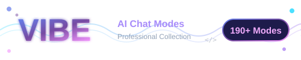

# VIBE - AI Chat Modes Collection

<p align="center">
  
</p>

<p align="center">
  <strong>Because apparently, your AI assistant needs more personality than you do.</strong>
</p>

<p align="center">
  <a href="#features">Features</a> •
  <a href="#modes">Modes</a> •
  <a href="#getting-started">Get Started</a> •
  <a href="#contributing">Contributing</a>
</p>

---

## What Is This?

Oh, just a **humble collection of 190+ AI chat modes** that'll make your AI assistant go from "generic helpful bot" to "actually knows what it's doing." You're welcome.

Did your AI just suggest using `var` in TypeScript? Does it keep recommending jQuery in 2024? Does it think "security best practices" means adding `// TODO: add security` comments?

**Yeah, we fixed that.**

## Features

| What You Get | Why You Need It |
|--------------|-----------------|
| **190+ Expert Modes** | Because one-size-fits-all is for socks, not AI |
| **30+ Categories** | Organized chaos is still organization |
| **Production-Ready Standards** | So you can pretend you wrote clean code yourself |
| **Universal Rules Engine** | Works with Claude, Copilot, Gemini, and that AI your company built in a hackathon |
| **Personality Modes** | Ever wanted Tony Stark to review your code? Now you can. |

## Mode Categories

### The Serious Stuff

```
Development & Architecture ........... 17 modes (for when you want things done right)
Cloud & Infrastructure ............... 11 modes (because "it works on my machine" isn't a deployment strategy)
Languages & Standards ................ 31 modes (14 languages, 13 coding standards, 4 databases)
Security & Compliance ................ 8 modes  (SOC 2, GDPR, SAST/DAST - all the acronyms)
AI/ML & Emerging Tech ................ 9 modes  (LLMs, MLOps, WebAssembly - the future is now)
DevOps & Platform Engineering ........ 8 modes  (GitOps, SRE, AIOps, Chaos Engineering)
Testing ............................. 14 modes (Chaos Monkey, Gremlin, LitmusChaos, Chaos Mesh - break things professionally)
```

### The Fun Stuff

```
Personality Modes .................... 10 modes (Sheldon Cooper as your code reviewer? Yes please)
Game Development ..................... 3 modes  (Unity, Unreal, Game Design)
```

## Getting Started

### Step 1: Clone This Repo

```bash
git clone https://github.com/anubhavg-icpl/vibe.git
```

*Revolutionary, I know.*

### Step 2: Pick a Mode

Browse `/modes` and find something that matches your existential crisis:

| You Want To... | Use This Mode |
|----------------|---------------|
| Write code that doesn't suck | `software-engineer-agent-mode` |
| Pretend you understand system design | `principal-engineer-mode` |
| Find security holes (before hackers do) | `wg-code-sentinel-mode` |
| Build ML pipelines | `mlops-expert-mode` |
| Break production (professionally) | `netflix-chaos-suite-mode` |
| Make your AI sound like Iron Man | `tony-stark-mode` |

### Step 3: Copy, Paste, Profit

Copy the mode content into your AI assistant. That's it. That's the whole process.

## Showcase: What These Modes Actually Do

### Example: Security Review Mode

**Without Vibe:**
> "Your code looks fine! Maybe add some input validation?"

**With `wg-code-sentinel-mode`:**
> "Line 47: SQL injection vulnerability. Line 89: Hardcoded AWS credentials (nice). Line 156: You're using `eval()` unironically. Let me walk you through the 17 ways this will get you featured on HaveIBeenPwned."

### Example: Chaos Engineering Mode

**Without Vibe:**
> "Consider testing your application's resilience."

**With `netflix-chaos-suite-mode`:**
> "Deploying Chaos Monkey to randomly terminate instances, Chaos Gorilla to drop AZs, and Chaos Kong to simulate regional failures. Here's your blast radius calculation, rollback procedures, and the exact Prometheus queries to monitor this experiment. Also, maybe don't run this on Friday."

### Example: Platform Engineering Mode

**Without Vibe:**
> "You could build an internal developer portal."

**With `platform-engineering-mode`:**
> "Here's a complete Backstage setup with software templates, Crossplane compositions for self-service infrastructure, and a platform API. Your developers will provision databases faster than they can argue about tabs vs spaces."

## Repository Structure

```
vibe/
├── .ai/rules/              # Universal rules (works everywhere)
├── modes/
│   ├── ai-ml/              # LLM, MLOps, Vector DBs
│   ├── architecture/       # System design, clean code
│   ├── cloud-infrastructure/ # AWS, GCP, Azure, Terraform, K8s
│   ├── coding-standards/   # Because consistency matters
│   ├── devops/             # GitOps, SRE, FinOps, AIOps
│   ├── frameworks/         # NestJS, FastAPI, Svelte, Remix, Nuxt
│   ├── infrastructure/     # Kafka, Istio, OpenTelemetry
│   ├── languages/          # 14 languages
│   ├── personalities/      # AI personas
│   ├── security/           # SAST/DAST, Compliance
│   ├── testing/            # Chaos, Contract, Security testing
│   └── ...                 # 20+ more categories
├── templates/              # Project templates
└── assets/                 # Logo and other assets
```

## Universal Rules Engine

Set up rules once, apply everywhere:

```
.ai/rules/
├── base.md          # Core coding standards
├── security.md      # Security requirements
├── testing.md       # Test coverage rules
└── ...
```

**Works with:** Claude Code, Amazon Q, GitHub Copilot, Gemini, Aider

*Finally, consistency across all your AI assistants without copying prompts like it's 2022.*

## Popular Modes

### Development
- `software-engineer-agent-mode` - Autonomous engineering with zero-confirmation policy
- `rust-beast-mode` - Comprehensive Rust development
- `blueprint-mode-v39` - Structured workflows (Debug, Express, Main, Loop)

### Infrastructure & DevOps
- `platform-engineering-mode` - Internal Developer Platforms with Backstage
- `aiops-expert-mode` - ML-powered anomaly detection and self-healing
- `netflix-chaos-suite-mode` - Chaos Monkey, Gorilla, Kong, and ChAP
- `gitops-expert-mode` - ArgoCD, Flux, GitOps patterns

### Security
- `wg-code-sentinel-mode` - Security vulnerability analysis
- `sast-dast-expert-mode` - Static and dynamic analysis
- `soc2-compliance-mode` - Compliance automation

### AI/ML
- `llm-expert-mode` - LLM development and fine-tuning
- `vector-database-expert-mode` - Pinecone, Weaviate, Milvus
- `mlops-expert-mode` - ML pipeline automation

## Stats

| Metric | Value |
|--------|-------|
| Total Modes | **165+** |
| Categories | **30+** |
| Languages Covered | **14** |
| Coding Standards | **13** |
| Project Templates | **16+** |
| Personality Modes | **10** |
| Testing/Chaos Modes | **14** |
| Security Modes | **10** |
| DevOps/Platform Modes | **11** |

## Contributing

Want to add a mode? Found a bug? Have strong opinions about code formatting?

1. Read [CONTRIBUTING.md](CONTRIBUTING.md)
2. Open a PR
3. Wait for someone to judge your code

We accept:
- New modes (the weirder, the better)
- Bug fixes (yes, even documentation has bugs)
- Improvements (but not "let's rewrite everything in Rust")

## FAQ

**Q: Why is it called "Vibe"?**
A: Because "A Comprehensive Collection of Specialized AI Chat Modes for Software Engineering" didn't fit on the repo name.

**Q: Does this actually work?**
A: Bold of you to ask. Yes, it works. 150+ modes don't just write themselves. (Actually, some of them were written by AI, but let's not get philosophical.)

**Q: Can I use these commercially?**
A: MIT License. Go wild. Just don't blame us when the Chaos Monkey mode takes down production.

**Q: Why are there personality modes?**
A: Because sometimes you need Gordon Ramsay to tell you your code is *raw*. It's therapeutic.

## License

MIT License - See [LICENSE](LICENSE)

Do whatever you want with this. We're not your parents.

---

<p align="center">
  <strong>Built by developers who got tired of explaining the same things to AI assistants.</strong>
</p>

<p align="center">
  <a href="https://github.com/anubhavg-icpl/vibe">Star this repo</a> •
  <a href="https://github.com/anubhavg-icpl/vibe/issues">Report Issues</a> •
  <a href="FEATURE_GAPS.md">See What's Coming</a>
</p>

---

**Author**: Anubhav Gain
**Repository**: [github.com/anubhavg-icpl/vibe](https://github.com/anubhavg-icpl/vibe)
