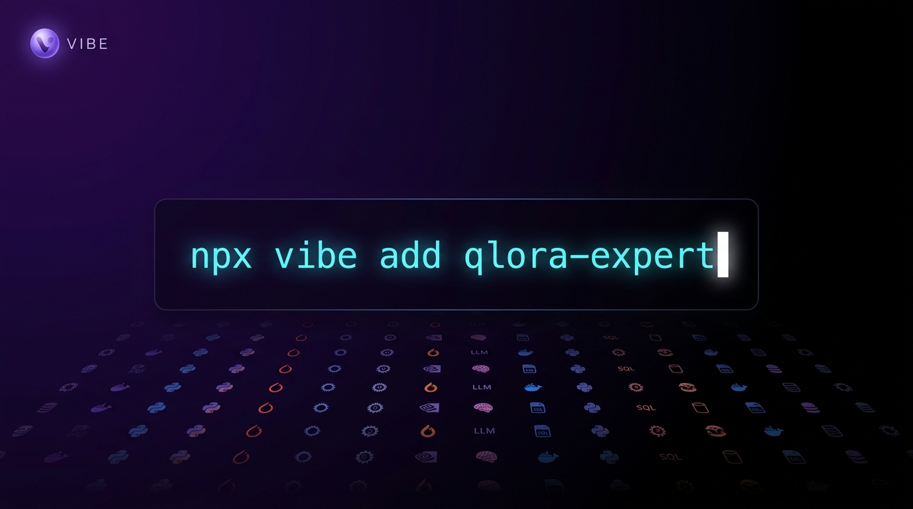

# VIBE — AI Chat Modes, Skills, Agents & Plugins

<p align="center">
  
</p>

<p align="center">
  <strong>Because apparently, your AI assistant needs more personality than you do.</strong>
</p>

<p align="center">
  <a href="#what-is-this">What Is This</a> •
  <a href="#features">Features</a> •
  <a href="#mode-categories">Modes</a> •
  <a href="#getting-started">Get Started</a> •
  <a href="#vibe-cli">CLI</a> •
  <a href="#stats">Stats</a> •
  <a href="#contributing">Contributing</a>
</p>

<p align="center">
  
  
  
  
  
  
  
  
  
  
</p>

---

<p align="center">
  
</p>

## What Is This?

A **massive collection of AI chat modes, skills, subagents, slash commands, plugins, output-styles, prompts, and recipes** that turn your AI assistant from "generic helpful bot" into "actually knows what it's doing across 853 specific domains."

Was 200 modes when this started. Then we kept going. And going. And going.

Did your AI just suggest using `var` in TypeScript? Recommend jQuery in 2026? Think "security best practices" means a `// TODO: add security` comment? Hallucinate APIs that don't exist? Think Polars is just "Pandas but newer"?

**Yeah, we fixed that — 853 times over.**

## Features

| What You Get                           | Why You Need It                                                                           |
| -------------------------------------- | ----------------------------------------------------------------------------------------- |
| **853 expert modes**                   | Because one-size-fits-all is for socks, not AI                                            |
| **52 categories**                      | Organized chaos is still organization                                                     |
| **5340 skills**                        | Reusable Claude/Codex/Amp/Droid skill bundles                                             |
| **200 subagents** in 10 sub-categories | Specialized workers for orchestration, QA, data, infra, language experts, etc.            |
| **112 slash commands** in 8 sub-cats   | `/architecture`, `/devops`, `/security`, `/testing`, `/git`, `/refactoring`...            |
| **120 plugins**                        | Ready-to-install plugin trees with their own agents + commands                            |
| **111 rules**                          | Universal behavior policies that work across Claude / Copilot / Gemini / Aider            |
| **106 prompt templates**               | Domain prompts from the AI Engineering from Scratch curriculum + more                     |
| **758 system prompts** (reference)     | Raw vendor system-prompt leaks + Claude Code prompts for study — reference-only           |
| **18 recipes**                         | End-to-end workflows (landing-page-in-20-min, repo-to-design-system, etc.)                |
| **33 Mythos security modes**           | Defensive vuln-discovery / red-team / patching / disclosure inspired by Project Glasswing |
| **174 design-system modes**            | Airbnb / Apple / Bento / Brutalist / Cinematic / Glass — pick an aesthetic                |
| **Production-grounded content**        | Every web-researched mode cites real URLs. No invented APIs. No hallucinated CVEs         |
| **VIBE CLI**                           | Install modes as skills to OpenCode, Claude Code, Codex, Cursor                           |
| **Engineer-persona modes**             | Code review by DHH, Carmack, Torvalds, antirez, Rich Hickey, Kleppmann (cited)            |

## Mode Categories

### The Stack You Actually Use (the new stuff)

```
ai-frameworks .................. 18 modes  (LangGraph, CrewAI, Pydantic AI, Mastra, DSPy, vLLM, Ollama)
ai-engineering ................. 20 modes  (math, ML, DL, NLP, LLMs, transformers, agents — full curriculum)
rag-advanced ................... 17 modes  (HyDE, ColBERT, GraphRAG, late-chunking, self-RAG, CRAG, RAPTOR)
llm-training ................... 19 modes  (LoRA, QLoRA, DoRA, DPO, ORPO, KTO, SimPO, GRPO, axolotl, unsloth)
llm-eval-ops ................... 18 modes  (Langfuse, LangSmith, Helicone, Phoenix, RAGAS, DeepEval, Promptfoo)
multimodal-ai .................. 19 modes  (Flux, SDXL, SD3.5, ComfyUI, ControlNet, Whisper, ElevenLabs, VLMs)
vector-stores .................. 18 modes  (pgvector, Qdrant, Weaviate, Milvus, Pinecone, Vespa, LanceDB, Chroma)
local-llm ...................... 19 modes  (llama.cpp, Ollama deploy, vLLM local, MLX, GGUF, SLMs)
model-authoring ................ 17 modes  (Modelfile, GGUF conversion, chat templates, tokenizers, publishing)
modern-web ..................... 18 modes  (Vite, Bun, Astro, Solid, Qwik, SvelteKit, Tailwind v4, shadcn)
edge-platforms ................. 16 modes  (Cloudflare Workers, Vercel, Fly, Supabase, Convex, Modal, Replicate)
data-platforms ................. 19 modes  (DuckDB, ClickHouse, Polars, Iceberg, Delta, Materialize, Ray, Kafka)
android-cli .................... 13 modes  (Google's agent-first CLI: skills, sdk, emulator, run, layout, screen)
android-platform ............... 17 modes  (Compose, Wear OS, TV, large screens, NDK, CameraX, Gemini in AS)
pi-dev .........................  5 modes  (pi.dev extensions, prompt-templates, packages, coding-agent)
```

### Defense in Depth — the Mythos suite

<p align="center">
  
</p>

Inspired by Anthropic's Project Glasswing & Claude Mythos Preview. Defensive-first framing throughout. Real CVEs only — no fabrications.

```
mythos/discovery ...............  9 modes  (zero-day-hunter, commit-archeologist, fuzzing-strategist, PoC-builder)
mythos/offense .................  8 modes  (exploit-dev, kernel-privesc, adversary-emulator — auth-gated)
mythos/defense .................  8 modes  (patch-generator, adversarial-validator, OSS-maintainer-helper, CVD)
mythos/specialty ...............  8 modes  (crypto, supply-chain, sandbox-escape, ICS, mobile, AI-LLM-probe, CTI)
```

### Aesthetic & Design

```
design-systems ................. 174 modes  (Airbnb, Apple, Bento, Brutalist, Cinematic, Glass, Indie, Playful + 35 from awesome-claude-design)
design-ux ......................   5 modes  (UI design, design tokens, design system architect)
ui-ux ..........................   6 modes  (UX research, accessibility designer)
creative .......................   5 modes
```

### People & Personalities

```
engineer-personas .............. 19 modes  (DHH, Carmack, Torvalds, Antirez, Bellard, Rich Hickey, Kleppmann + 12 more)
personalities .................. 10 modes  (Tony Stark, Sheldon, Gordon Ramsay-as-code-reviewer, etc.)
```

### The Classic Stuff

```
testing ........................ 22 modes   (chaos eng, contract, security testing, BDD, mutation)
languages ...................... 14 modes   (Rust, Go, TS, Python, Kotlin, Swift, Zig, Elixir, etc.)
frameworks ..................... 11 modes   (NestJS, FastAPI, Svelte, Remix, Nuxt, Phoenix)
backend ........................ 11 modes
infrastructure ................. 10 modes   (Kafka, Istio, OpenTelemetry, ArgoCD)
cloud-infrastructure ...........  6 modes   (AWS, GCP, Azure, Terraform, K8s)
devops .........................  9 modes   (GitOps, SRE, FinOps, AIOps, Chaos)
security ....................... 18 modes   (SAST/DAST, SOC2, GDPR + 6 enterprise sign-off)
database .......................  9 modes
architecture ...................  7 modes
documentation ..................  5 modes
debugging ......................  5 modes
refactoring ....................  5 modes
planning .......................  5 modes
mobile .........................  5 modes
game-development ...............  5 modes
blockchain .....................  5 modes
emerging-tech ..................  5 modes
ebpf ........................... (subdir)   eBPF program type docs (security/network/observability)
rfc ............................ 16 modes   IETF/W3C standards (HTTP/2, OAuth 2.1, gRPC, etc.)
project-structure .............. 21 modes
specialized ....................  7 modes
+ 10 more ......................  (analysis, learning, output-formats, coding-standards, ...)
```

## Install as a Plugin (any CLI, one command)

Vibe ships **manifests for every major coding-agent CLI** at the repo root, so you can install the entire library with a single command — no clone, no copy-paste. The same `skills/`, `agents/`, `commands/`, `hooks/` directories are exposed via each harness's native plugin system.

| CLI               | Install command                                                                                            |
| ----------------- | ---------------------------------------------------------------------------------------------------------- |
| **Claude Code**   | `/plugin marketplace add anubhavg-icpl/vibe` then `/plugin install vibe@vibe`                              |
| **Codex CLI/App** | `/plugins` → search `vibe` → Install                                                                       |
| **Cursor**        | `/add-plugin vibe` (or search "vibe" in the plugin marketplace)                                            |
| **OpenCode**      | Add `"plugin": ["github:anubhavg-icpl/vibe"]` to `~/.config/opencode/opencode.json`                        |
| **Gemini CLI**    | `gemini extensions install https://github.com/anubhavg-icpl/vibe`                                          |
| **Copilot CLI**   | `copilot plugin marketplace add anubhavg-icpl/vibe` then `copilot plugin install vibe@vibe`                |
| **Factory Droid** | `droid plugin marketplace add https://github.com/anubhavg-icpl/vibe` then `droid plugin install vibe@vibe` |

Once installed, all 5340 skills are discoverable via the harness's native skill tool. Skills auto-load on relevance — no further config needed.

### Manifest layout in this repo

```
vibe/
├── .claude-plugin/         plugin.json + marketplace.json   (Claude Code)
├── .codex-plugin/          plugin.json                      (Codex CLI / App)
├── .cursor-plugin/         plugin.json + marketplace.json   (Cursor)
├── .factory-plugin/        plugin.json                      (Factory Droid)
├── .github/plugin/         plugin.json + marketplace.json   (GitHub Copilot CLI)
├── .opencode/              plugin.js                        (OpenCode — JS plugin)
├── gemini-extension.json   (Gemini CLI extension manifest)
├── GEMINI.md               (Gemini context file)
└── skills/                 (shared — every CLI reads this directory)
```

> **Modes (853):** chat-mode prompts under `modes/` are not auto-loaded by any CLI marketplace — install them with the [VIBE CLI](#vibe-cli--install-modes-as-skills) below.

---

## Getting Started

### Step 1: Clone

```bash
git clone https://github.com/anubhavg-icpl/vibe.git
```

### Step 2: Pick a Mode

Browse `/modes` and find something matching your situation. Examples:

| You Want To...                                         | Use This Mode                                           |
| ------------------------------------------------------ | ------------------------------------------------------- |
| Write code that doesn't suck                           | `software-engineer-agent-mode`                          |
| Think like DHH about a microservices proposal          | `modes/engineer-personas/dhh-style-mode`                |
| Have Carmack-grade simplicity in your review           | `modes/engineer-personas/carmack-style-mode`            |
| Build a RAG with reranking + hybrid search             | `modes/rag-advanced/hybrid-search-expert-mode`          |
| Fine-tune with QLoRA on a single GPU                   | `modes/llm-training/qlora-expert-mode`                  |
| Deploy llama.cpp behind nginx with auth                | `modes/local-llm/llama-cpp-server-expert-mode`          |
| Write an Ollama Modelfile for your fine-tune           | `modes/model-authoring/ollama-modelfile-expert-mode`    |
| Hunt vulnerabilities like Mythos Preview               | `modes/mythos/discovery/mythos-zero-day-hunter-mode`    |
| Build UI with Airbnb's design language                 | `modes/design-systems/airbnb-design-mode`               |
| Use Cloudflare Workers + D1 + Durable Objects properly | `modes/edge-platforms/cloudflare-workers-expert-mode`   |
| Spin up a project with Google's android CLI            | `modes/android-cli/android-create-template-expert-mode` |
| Make your AI sound like Iron Man                       | `modes/personalities/tony-stark-mode`                   |

### Step 3: Copy, Paste, Profit

Copy mode content into your AI assistant. Done.

---

## VIBE CLI — One Command, Zero Install

<p align="center">
  
</p>

Vibe ships a `vibe` CLI that installs the **entire library** (skills, agents, commands, modes) into any of **7 coding-agent CLIs** in one shot. No `npm install -g`, no clone — just `npx`.

```bash
# Interactive — splash, fuzzy picker, target detection, multi-select
npx -y github:anubhavg-icpl/vibe

# Non-interactive — install named items into all detected agents
npx -y github:anubhavg-icpl/vibe add brainstorming systematic-debugging

# Detect what's installed and where
npx -y github:anubhavg-icpl/vibe doctor

# Browse / list / preview without installing
npx -y github:anubhavg-icpl/vibe list --kind skill
npx -y github:anubhavg-icpl/vibe info systematic-debugging
npx -y github:anubhavg-icpl/vibe search "rag"
npx -y github:anubhavg-icpl/vibe targets
```

Pin to a specific revision: `npx -y github:anubhavg-icpl/vibe#master`. Or alias the long form: `alias vibe='npx -y github:anubhavg-icpl/vibe'`.

### Subcommands

| Command                    | What it does                                                                |
| -------------------------- | --------------------------------------------------------------------------- |
| `vibe`                     | Interactive: splash → fuzzy picker → multi-select → target picker → install |
| `vibe add <names...>`      | Install one or more named assets (fuzzy match)                              |
| `vibe list [--kind ...]`   | List bundled assets, optionally filtered by kind                            |
| `vibe info <name>`         | Rich preview of one asset + per-target install paths                        |
| `vibe search <query>`      | Fuzzy search the library                                                    |
| `vibe targets`             | Show the 7 target CLIs and which ones are detected on this machine          |
| `vibe doctor`              | Diagnose env: node version, asset count, target detection                   |
| `vibe init`                | Create `.vibeconfig.yaml` in cwd                                            |
| `vibe completions [shell]` | Generate bash/zsh/fish completion script                                    |

### Supported Targets (7 CLIs)

| Target                 | Skills                      | Agents                      | Commands                      | Detection probe             |
| ---------------------- | --------------------------- | --------------------------- | ----------------------------- | --------------------------- |
| **Claude Code**        | `~/.claude/skills/`         | `~/.claude/agents/`         | `~/.claude/commands/`         | `~/.claude` exists          |
| **OpenAI Codex**       | `~/.codex/skills/`          | `~/.codex/agents/`          | `~/.codex/commands/`          | `~/.codex` exists           |
| **Cursor**             | `~/.cursor/skills/`         | `~/.cursor/agents/`         | `~/.cursor/commands/`         | `~/.cursor` exists          |
| **OpenCode**           | `~/.config/opencode/skill/` | `~/.config/opencode/agent/` | `~/.config/opencode/command/` | `~/.config/opencode` exists |
| **Gemini CLI**         | `~/.gemini/skills/`         | `~/.gemini/agents/`         | `~/.gemini/commands/`         | `~/.gemini` exists          |
| **GitHub Copilot CLI** | `~/.copilot/skills/`        | `~/.copilot/agents/`\*      | `~/.copilot/commands/`        | `~/.copilot` exists         |
| **Factory Droid**      | `~/.factory/skills/`        | `~/.factory/droids/`†       | `~/.factory/commands/`        | `~/.factory` exists         |

\*Copilot agents land with `.agent.md` extension. †Droid renames `agents/` to `droids/`.

### Common flags

```bash
--global / -g            # install user-level (default: project/cwd-level)
--agent <names...>       # restrict to specific targets
--kind <skill|agent|command|mode>  # filter by asset kind
--category <name>        # filter by category
--yes / -y               # skip confirmation prompts (CI-friendly)
--json                   # JSON output for scripting
```

### How it works

1. `npx github:anubhavg-icpl/vibe` clones this repo to a temp cache and runs the bundled `dist/index.js`.
2. The CLI discovers all 1,965 assets across `skills/`, `agents/`, `commands/`, `modes/` in the cloned repo.
3. Skills are copied as-is (already in `SKILL.md` format). Modes are converted to `SKILL.md` skills with frontmatter. Agents and commands are dropped as `.md` files (with `.agent.md` extension for Copilot).
4. Detection auto-selects targets that exist on your machine. Use `--agent` to override.

---

## Bundled External Collections

Vibe ships with several upstream collections, each prefixed for clear provenance:

| Source                                   | What                                                 | Prefix   |
| ---------------------------------------- | ---------------------------------------------------- | -------- |
| **rohitg00/ai-engineering-from-scratch** | 361 domain skills + 99 prompts + 20 phase modes      | (none)   |
| **rohitg00/awesome-claude-design**       | 35 design-md modes + 6 prompts + 13 recipes          | `acd-`   |
| **rohitg00/awesome-claude-code-toolkit** | 136 agents + 42 commands + 37 skills + 120 plugins   | (none)   |
| **affaan-m/everything-claude-code**      | 182 skills + 48 agents + 89 rules + 1 plugin tree    | `ecc-`   |
| **0xDarkMatter/claude-mods**             | 74 skill dirs + 23 agents + 13 output-styles + tools | `cmods-` |
| **badlogic/pi-skills**                   | 8 cross-tool skills (brave-search, gccli, vscode...) | `pi-`    |
| **open-design/design-systems**           | 138 design-system modes (139 with README)            | (none)   |

All originals untouched in their dirs of origin.

---

## System Prompts (Reference)

A curated collection of **758 raw vendor system prompts** lives under `system-prompts/` — leaked/published chatbot system prompts from across the industry (Anthropic, OpenAI, Google, Meta, Microsoft, Mistral, Notion, Perplexity, Qwen, xAI, Cursor, and more) plus version-tracked Claude Code system/agent/tool prompts. They're here for study: reverse-engineering how production assistants are steered, formatted, and guardrailed. This collection is **reference-only — not installable via the VIBE CLI or any plugin marketplace.** The CLI only handles `skill`, `agent`, `command`, and `mode` kinds; raw system prompts are documents to read, not assets to load into a harness.

How to access them:

- **Clone the repo** and open `system-prompts/` — start with `system-prompts/README.md` for full attribution.
- **Browse `system-prompts/INDEX.md`** for the generated index of all 758 files.
- **Raw-download a single file** straight from GitHub when you only need one.

Sourced from two upstream repos, both untouched and credited:

- [asgeirtj/system_prompts_leaks](https://github.com/asgeirtj/system_prompts_leaks) — multi-vendor chatbot system-prompt leaks.
- [Piebald-AI/claude-code-system-prompts](https://github.com/Piebald-AI/claude-code-system-prompts) — version-tracked Claude Code prompts (under `system-prompts/Piebald-ClaudeCode/prompts/`).

---

## Showcase: What These Modes Actually Do

### `mythos-zero-day-hunter-mode` (defensive)

> "I read this codebase. The fuzz harness covers `parser_main` but not `parser_aux` — and `parser_aux` does the same `memcpy` without the bounds check that was added to `parser_main` in commit a1b2c3d. Let me trace the input path... yes, attacker-reachable through `/api/v2/upload`. Here's the PoC, the patch, the regression test, and the GitHub Security Advisory draft. Disclosure window: 90 days unless actively exploited."

### `dhh-style-mode`

> "Why are you building a separate microservice for this? It's three database queries. Put it in the monolith, ship it Tuesday, and stop reading Hacker News. — DHH (paraphrased from his Rails World 2024 keynote, cited)."

### `cloudflare-workers-expert-mode`

> "You don't need a queue here — you've got 27 events a minute. Use a Durable Object with `input gates` and a `setAlarm()` for the batch flush. Here's the binding config, the worker code, and the wrangler.toml. Cost at your scale: ~$5/mo."

### `qlora-expert-mode`

> "Single A100 80GB? You can fit Qwen2.5-32B with NF4 + double quant + paged optimizers, rank 64, alpha 128, on `attn` + `mlp` modules. Here's the axolotl YAML. Expect ~2hr/epoch on a 50k-sample dataset. Don't forget to merge before serving."

### `airbnb-design-mode`

> "Use Rausch coral (`#ff385c`) only for primary CTAs and the search button — never for body copy or secondary buttons. Cards are 4:3 with 14-20px corner radius, full-bleed photography. Sticky booking panel right-rail on desktop, bottom-anchored Reserve bar on mobile. One typeface (Cereal VF) for everything from 8px legal to 28px headings."

---

## Repository Structure

```text
vibe/
├── .ai/rules/                 # Universal rules (works across agents)
├── agents/                    # 200 installable subagents, 10 categories + cmods/ + ecc/
│   ├── business-product/      # PM-style agents
│   ├── core-development/      # ui-designer, monorepo-architect, websocket-engineer
│   ├── data-ai/               # data + ML agents
│   ├── developer-experience/
│   ├── infrastructure/
│   ├── language-experts/
│   ├── orchestration/
│   ├── quality-assurance/
│   ├── research-analysis/
│   ├── specialized-domains/
│   ├── cmods/                 # 23 from claude-mods
│   ├── ecc/                   # 48 from everything-claude-code
│   └── *.md                   # 9 originals (architect, code-reviewer, planner...)
├── commands/                  # 112 installable slash commands across categories + ecc/ + cmods/
│   ├── architecture/, devops/, documentation/, git/, refactoring/,
│   │   security/, testing/, workflow/
│   ├── ecc/, cmods/
│   └── *.md                   # 10 originals
├── contexts/                  # dev / research / review + ecc-*
├── examples/                  # CLAUDE.md examples + sessions + ecc/
├── hooks/                     # Hook configurations + ecc/ + cmods/
├── mcp-configs/               # MCP server registry + ecc-mcp-servers.json
├── modes/                     # 853 installable chat modes — 52 categories (see breakdown above)
├── output-styles/             # 13 output styles (cmods)
├── plugins/                   # 120 plugin trees (each with agents/ + commands/)
├── prompts/                   # 106 prompt templates (99 ai-eng + 6 acd + 1 readme)
├── system-prompts/            # 758 reference system prompts (asgeirtj leaks + Piebald Claude Code) — see system-prompts/INDEX.md
├── recipes/                   # 18 end-to-end recipes + case-studies/
├── rules/                     # 111 rules (8 originals + 89 ecc + 9 toolkit + 5 cmods)
├── scripts/                   # generate-modes-index.py, fix-diagrams.py
├── skills/                    # 5340 installable skills (vibe + ai-engineering + pi + cmods + ecc + toolkit)
├── src/                       # VIBE CLI (TypeScript)
├── templates/                 # claude-md/ + project-starters/ + cmods/
├── tools/                     # cmods/ (perplexity.py, install scripts)
├── docs/                      # ecc/ (CLAUDE.md, RULES.md, the-*-guide.md) + cmods/
├── modes-index.json           # auto-generated index of all modes
└── modes-index.schema.json    # JSON schema for the index
```

## Universal Rules Engine

```
rules/
├── coding-style.md         agents.md         git-workflow.md
├── hooks.md                patterns.md       performance.md
├── security.md             testing.md
├── ecc-{language-prefix}-*.md   # 89 language/topic rules from ecc
├── cmods-*.md                   # 5 from claude-mods
└── ...
```

**Works with:** Claude Code, Amazon Q, GitHub Copilot, Gemini, Aider, OpenCode, Codex CLI, Amp, Droid.

---

## Stats

| Metric                        | Value   |
| ----------------------------- | ------- |
| **Total Modes**               | **853** |
| **Categories**                | **52**  |
| Mythos security modes (4 sub) | 33      |
| Design-system modes           | 174     |
| Engineer-persona modes        | 19      |
| AI / RAG / training / eval    | 109     |
| Modern-stack (web/edge/data)  | 53      |
| Local LLM + model-authoring   | 36      |
| Android (CLI + platform)      | 30      |
| **Total Skills**              | **5340** |
| **Total Subagents**           | **200** |
| **Total Commands**            | **112** |
| **Total Plugins**             | **120** |
| **Total Rules**               | **111** |
| **Total Prompts**             | **106** |
| **Total Recipes**             | **18**  |
| **Output Styles**             | **13**  |
| **Templates**                 | **13**  |
| Languages covered             | 14+     |
| Project templates             | 22+     |
| **Bundled external sources**  | **7**   |

---

## Contributing

Want to add a mode? Found a bug? Have strong opinions about formatting?

1. Read [CONTRIBUTING.md](CONTRIBUTING.md)
2. Open a PR
3. Wait for someone to judge your code

We accept:

- New modes (the weirder the better — provided you can cite real sources)
- Bug fixes (yes, even docs have bugs)
- Improvements (but not "let's rewrite the whole CLI in Rust")

**Mode authoring rules** (per `modes/engineer-personas/` precedent):

- Web-researched modes MUST cite real URLs that you actually fetched
- Persona modes MUST attribute quotes to verifiable public sources (talks, blog posts, interviews)
- Security modes MUST carry defensive framing — Mythos offense modes carry mandatory authorization gates
- No invented APIs, no hallucinated CVE numbers, no fabricated framework features

## FAQ

**Q: Why is it called "Vibe"?**
A: Because "A Comprehensive Collection of 853 Specialized AI Chat Modes Plus 800 Skills, 200 Subagents, 120 Plugins, and 111 Rules" wouldn't fit in the GitHub repo name field.

**Q: Does this actually work?**
A: 853 modes don't write themselves. (Well, some did — but they web-searched first and cited their sources, which is more than most humans bother to do.)

**Q: Can I use these commercially?**
A: License is CC BY-NC-SA 4.0 — non-commercial use is free with attribution. For commercial use, reach out for licensing. Either way, don't blame us when `mythos-uac-bypass-creative-mode` refuses to operate on systems you didn't write authorization for. (That's the point. Read the Authorization Gate.)

**Q: Why are there personality modes?**
A: Because sometimes you need Gordon Ramsay to tell you your code is _raw_. Or DHH to tell you that you don't need Kubernetes. Both are therapeutic.

**Q: Why do mythos offense modes refuse so much?**
A: Because the underlying capability is dual-use, the threat model is real, and the only legitimate path is coordinated disclosure. Read the Authorization Gate sections — they're not boilerplate, they're the contract.

**Q: How do I keep up with new modes?**
A: `git pull` and check the `modes-index.json` diff. Or watch the repo.

## License

[CC BY-NC-SA 4.0](LICENSE) — Creative Commons Attribution-NonCommercial-ShareAlike 4.0 International.

You're free to share and adapt the material for **non-commercial use**, with attribution, under the same license. For commercial licensing, get in touch.

---

<p align="center">
  <strong>Built by developers who got tired of explaining the same things to AI assistants 853 different ways.</strong>
</p>

<p align="center">
  <a href="https://github.com/anubhavg-icpl/vibe">Star this repo</a> •
  <a href="https://github.com/anubhavg-icpl/vibe/issues">Report Issues</a> •
  <a href="modes-index.json">Browse the Mode Index</a>
</p>

---

**Author**: Anubhav Gain
**Repository**: [github.com/anubhavg-icpl/vibe](https://github.com/anubhavg-icpl/vibe)
